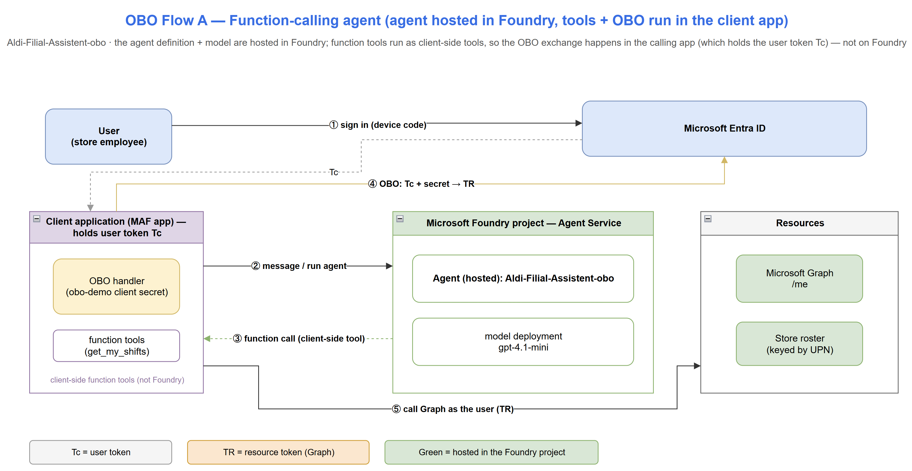
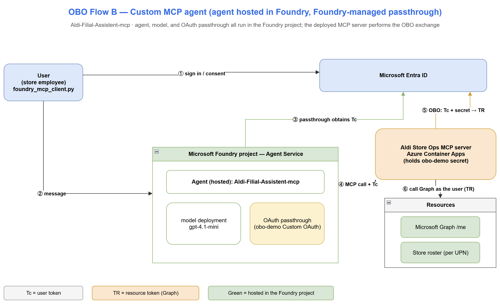

# OBO Foundry Demo

Demonstrates the **On-Behalf-Of (OBO) / OAuth identity passthrough** flow with
Microsoft Foundry agents built on the **Microsoft Agent Framework (MAF)**, in two
phases:

- **Phase 1** — OBO with no MCP, no server (the agent's own code does the exchange).
- **Phase 2** — a custom **MCP server** on Azure Container Apps, with Foundry
  managing the OBO exchange via **OAuth identity passthrough**.

Foundry project: `aldi-workshop`. Entra app: `obo-demo`
(`d03a0769-69cf-4601-afd6-2ba5f92aeadd`). Deployed MCP server:
`https://aldi-store-ops-mcp.blackbeach-39f4dfc4.swedencentral.azurecontainerapps.io/mcp`

## Architecture

Two OBO variants, one per phase (source: [docs/obo-architecture.drawio](docs/obo-architecture.drawio)):

### Flow A — Phase 1: function-calling agent

The agent definition and model are hosted in Foundry; the function tools and the
OBO exchange run in the client (MAF) app, which holds the user token **Tc**.



### Flow B — Phase 2: custom MCP agent

The agent, model, and OAuth passthrough all run in the Foundry project; the
deployed MCP server performs the OBO exchange.



## Setup

1. `cp .env.example .env` and fill in `TENANT`, `CLIENT_ID`, `CLIENT_SECRET`,
   `PROJECT_ENDPOINT`, `MODEL_DEPLOYMENT_NAME`.
2. `python -m pip install --only-binary=:all: -r requirements.txt`
   (force wheels; the machine builds native deps from source otherwise).
3. `az login` (the MAF agents use `DefaultAzureCredential` for the Foundry project).

## Files

| File | Role |
|------|------|
| `auth.py` | Device-code sign-in → user token (**Tc**) |
| `consent.py` | One-time Graph `User.Read` consent (no admin consent needed) |
| `obo.py` | OBO exchange (**Tc + secret → TR**) + Graph helpers |
| `agent.py` | **Phase 1** OBO agent (MAF) — "who am I?" |
| `filial_agent.py` | Aldi store assistant (MAF) — mock tools, no identity |
| `filial_agent_obo.py` | Store assistant (MAF) + OBO per-employee tools |
| `mcp_server/` | **Phase 2** MCP server (OBO passthrough) + Dockerfile + deploy |
| `register_foundry_mcp_agent.py` | Create the Foundry agent that uses the MCP tool |
| `foundry_mcp_client.py` | Client with the Foundry consent loop |

## Phase 1 — run the MAF agents

```
python agent.py                                          # OBO "who am I" (device sign-in)
python filial_agent.py                                   # store assistant (no sign-in)
python filial_agent_obo.py "Welche Schichten habe ich?"  # OBO per-employee
```

## Phase 2 — custom MCP server

### a) Deploy (done)
```
./mcp_server/deploy.ps1        # az containerapp up, public HTTPS, secret for CLIENT_SECRET
```

### b) Register the MCP tool in Foundry (portal — your action)
Foundry portal → **Add Tools → Custom → MCP → OAuth Identity Passthrough →
Custom OAuth**, reusing the `obo-demo` app:

| Field | Value |
|-------|-------|
| server_url | `https://aldi-store-ops-mcp.blackbeach-39f4dfc4.swedencentral.azurecontainerapps.io/mcp` |
| Client ID | `d03a0769-69cf-4601-afd6-2ba5f92aeadd` |
| Client secret | (from Certificates & secrets) |
| Auth URL | `https://login.microsoftonline.com/f0e88043-72b8-4382-a4c0-b3be4d605aa5/oauth2/v2.0/authorize` |
| Token URL | `https://login.microsoftonline.com/f0e88043-72b8-4382-a4c0-b3be4d605aa5/oauth2/v2.0/token` |
| Refresh URL | (same as Token URL) |
| Scopes | `api://d03a0769-69cf-4601-afd6-2ba5f92aeadd/access_as_user offline_access` |

Note the **connection id/name** the portal creates.

### c) Add the redirect URL (your action)
Foundry returns a redirect URL after step (b). Add it to the `obo-demo` app →
**Authentication → Redirect URIs (Web)**.

### d) Create the agent + run the consent loop
```
# set MCP_SERVER_URL and MCP_CONNECTION_ID (from step b) in .env, then:
python register_foundry_mcp_agent.py
python foundry_mcp_client.py "Welche Schichten habe ich?"
```
On first use per user, Foundry returns an `oauth_consent_request`; the client
prints the `consent_link`, waits for you to sign in, then resubmits with
`previous_response_id`.

## Notes
- The MCP server validates each caller's token audience (`obo-demo`) before any
  OBO exchange (`MCP_VERIFY_SIGNATURE=true`).
- Custom OAuth is required (not managed) because it's your own server — Foundry
  blocks Microsoft-audience tokens on custom endpoints.

See the [MCP authentication docs](https://learn.microsoft.com/azure/ai-foundry/agents/how-to/mcp-authentication).
